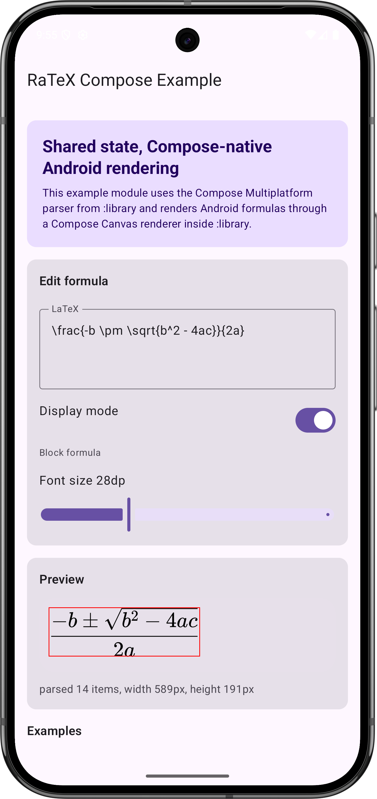
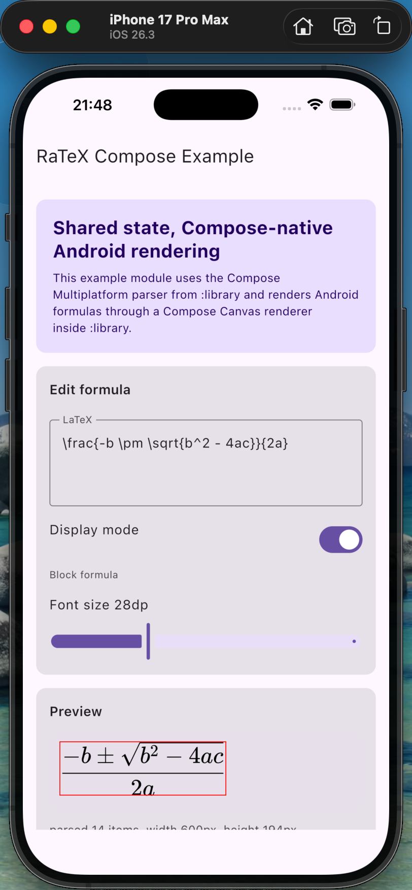
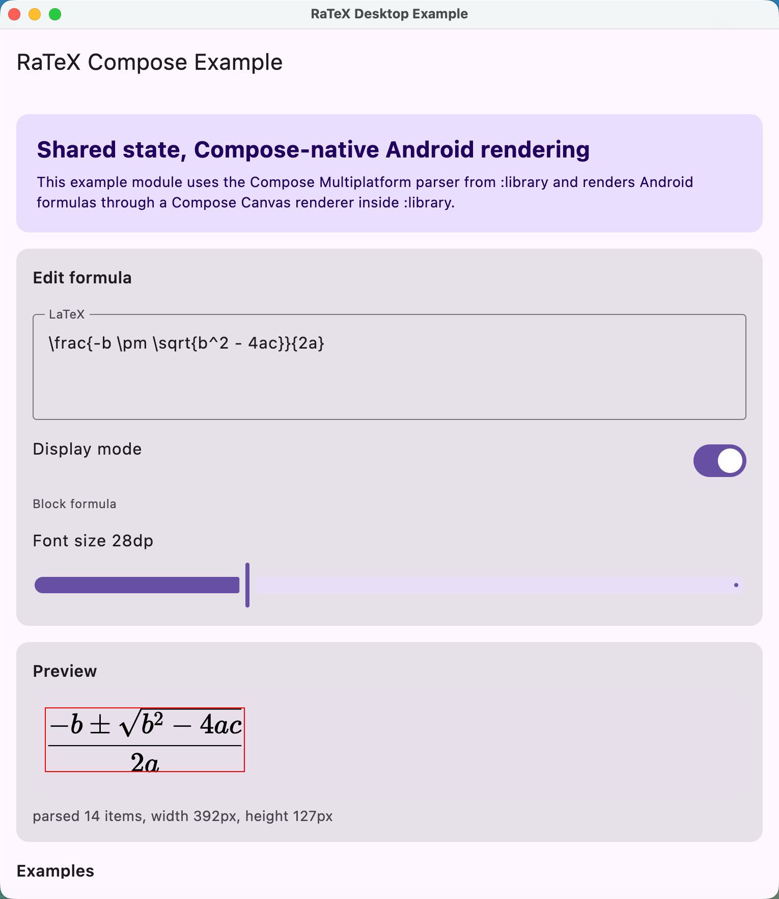

# RaTeX-CMP

[English Version](README-en.md) | [中文版本](README.md)

[](https://opensource.org/licenses/MIT)
[]([http://kotlinlang.org](https://www.jetbrains.com/kotlin-multiplatform/))

✨ RaTeX-CMP is a math formula rendering project for multi-platform UI scenarios, built with Kotlin Multiplatform and Compose Multiplatform. Its core rendering capability is powered by [RaTeX](https://github.com/erweixin/RaTeX).

It allows the same formula rendering engine to be reused across Android, iOS, and JVM Desktop, making it easier to integrate consistent mathematical typesetting and display into Compose Multiplatform applications.

This repository is maintained as an independent project. It can continue evolving as a library while also serving as a sample project and integration reference.

## 🌍 Supported Platforms

| Platform | Architectures / Targets | Notes |
| --- | --- | --- |
| Android | `arm64-v8a`, `armeabi-v7a`, `x86_64`, `x86` | `x86` is currently untested |
| iOS | iPhone / Simulator | Integrated via Kotlin Multiplatform Framework |
| JVM Desktop | Windows `x86_64`, macOS `x86_64` / `arm64`, Linux `x86_64` / `arm64` | Desktop native libraries are built and published based on what the current machine supports |

## 📷 Screenshots

<table>
  <thead>
    <tr>
      <th width="25%">Android</th>
      <th width="25%">iOS</th>
      <th width="50%">JVM Desktop</th>
    </tr>
  </thead>
  <tbody>
    <tr>
      <td></td>
      <td></td>
      <td></td>
    </tr>
  </tbody>
</table>

## 🧭 Repository Overview

- `library`: core library module
- `example`: shared sample module, including the Desktop entry point
- `androidApp`: Android sample app
- `iosApp`: iOS sample project
- `external/RaTeX`: upstream RaTeX submodule

## 🛠️ Local Development

### 1. Clone the repository and initialize submodules

```bash
git clone https://github.com/darriousliu/RaTeX-CMP.git
cd RaTeX-CMP
git submodule update --init --recursive
```

If you have already cloned the repository but have not initialized submodules, you can simply run the last command.

### 2. Prepare the base environment

Recommended tools:

- JDK 17
- Android Studio or IntelliJ IDEA
- Rust toolchain
- Bash environment
- Android SDK; Android NDK is also required if you want to build Android native libraries
- Xcode; required only when developing for iOS on macOS

Depending on the platform, you may also need:

- Android: `cargo-ndk`
- Desktop full-platform native packaging: `cargo-zigbuild` and `zig`

### 3. Install the required Rust targets

Before running or building for a platform for the first time, it is recommended to install the required Rust targets for that platform.

Android:

```bash
rustup target add aarch64-linux-android armv7-linux-androideabi x86_64-linux-android i686-linux-android
```

iOS:

```bash
rustup target add aarch64-apple-ios aarch64-apple-ios-sim x86_64-apple-ios
```

JVM Desktop:

- When building only for the current host platform, you usually do not need to run `rustup target add` manually
- When running `bash prepare-jvm-rust.sh --all`, the script automatically selects all targets supported by the current machine and runs `rustup target add` as needed
- For example, on `arm64 macOS`, it builds `darwin-aarch64`, `darwin-x86-64`, `linux-aarch64`, and `linux-x86-64`, but does not attempt `windows-x86-64`

### 4. Prepare local artifacts

If this is your first time running the project, or if you changed the underlying Rust code, you will usually need to prepare the corresponding local artifacts first.

Android:

```bash
bash prepare-android-rust.sh
```

iOS:

```bash
bash prepare-ios-rust.sh
```

JVM Desktop:

```bash
bash prepare-jvm-rust.sh
```

Prepare all Desktop Rust artifacts supported by the current machine:

```bash
bash prepare-jvm-rust.sh --all
```

If you are only working on the Kotlin / Compose layer and usable artifacts already exist in the repository, run these commands only when needed instead of every time.

### 5. Run and verify

JVM Desktop sample:

```bash
./gradlew :example:run
```

On Windows:

```bash
.\gradlew.bat :example:run
```

Android debug package:

```bash
./gradlew :androidApp:assembleDebug
```

On Windows:

```bash
.\gradlew.bat :androidApp:assembleDebug
```

For iOS development, it is recommended to open `iosApp/iosApp.xcodeproj` on macOS for debugging.

### 6. Development suggestions

- Prefer completing Compose UI, Kotlin API, and sample project work within this repository first
- Enter `external/RaTeX` only when you need to coordinate with the lower-level engine
- After updating the submodule, remember to regenerate the corresponding platform artifacts
- When committing changes, distinguish carefully between changes in this project and changes in the submodule

## 🚀 Common Commands

Initialize submodules:

```bash
git submodule update --init --recursive
```

Run the Desktop sample:

```bash
./gradlew :example:run
```

Build the Android sample:

```bash
./gradlew :androidApp:assembleDebug
```

Prepare Android Rust artifacts:

```bash
bash prepare-android-rust.sh
```

Prepare iOS Rust artifacts:

```bash
bash prepare-ios-rust.sh
```

Prepare Desktop Rust artifacts:

```bash
bash prepare-jvm-rust.sh
```

Prepare all Desktop Rust artifacts supported by the current machine:

```bash
bash prepare-jvm-rust.sh --all
```

Publish the library to Maven Central:

Make sure your publishing credentials and signing configuration are ready before publishing.

Publish all `library` artifacts, including the KMP main library, platform artifacts, and JVM Desktop native libraries:

```bash
./gradlew :library:publishAndReleaseToMavenCentral
```

Publish only the KMP main library:

```bash
./gradlew :library:publishKotlinMultiplatformPublicationToMavenCentralRepository
```

Publish all JVM Desktop native libraries supported by the current machine:

```bash
./gradlew :library:publishSupportedDesktopNativePublicationsToMavenCentralRepository
```

Publish all JVM Desktop native libraries supported by the current machine to Maven Local:

```bash
./gradlew :library:publishSupportedDesktopNativePublicationsToMavenLocal
```

This task automatically:

- runs `bash prepare-jvm-rust.sh --all`
- verifies that Desktop native artifacts supported by the current machine were generated successfully
- publishes all Desktop native publications supported by the current machine

For example:

- On `arm64 macOS`, it publishes `darwin-aarch64`, `darwin-x86-64`, `linux-aarch64`, and `linux-x86-64`
- On `Linux`, it publishes `linux-aarch64` and `linux-x86-64`
- On `Windows`, it publishes `windows-x86-64`

## 🙏 Acknowledgements

Thanks to the [RaTeX](https://github.com/erweixin/RaTeX) project for providing the core capabilities and open-source foundation.

Thanks also to Kotlin Multiplatform, Compose Multiplatform, Rust, and the related open-source communities for making this cross-platform project possible and helping it continue to evolve in a more unified way across platforms.
